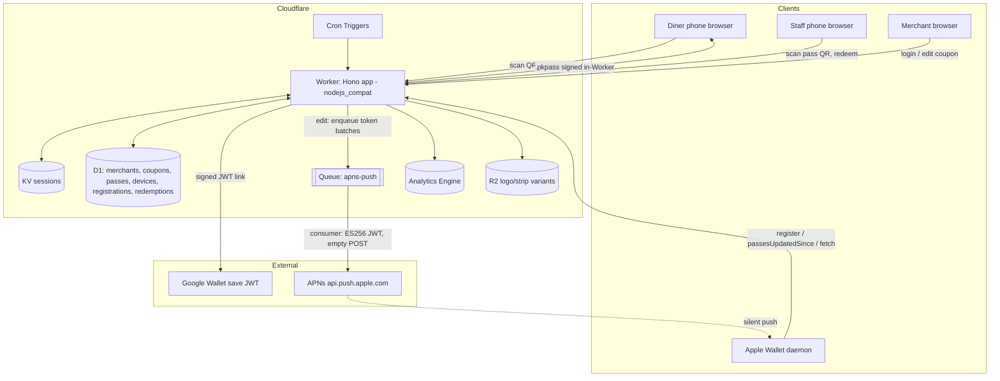

# Currant — Development Plan

**Product:** Restaurant coupon platform on Apple Wallet / Google Wallet (see `docs/BRAND.md`).
**Stack:** 100% Cloudflare developer platform. **Status:** MVP built in `platform/` and verified end-to-end locally (see §3).

---

## 1. Team structure (this sprint)

| Role | Owner | Responsibilities & objectives |
|---|---|---|
| Head of Brand & Positioning | delegated agent | Naming (candidates + collision research), identity system, voice, applied copy → `docs/BRAND.md` ✅ |
| Principal Architect, Cloudflare | delegated agent | Product selection with official-docs citations, limits verification, phased plan, cost model → §4 below ✅ |
| Founding Engineer | CEO/CTO | MVP implementation in `platform/`, brand integration, end-to-end verification ✅ |
| QA & Release | CEO/CTO | Typecheck + runtime verification, repo hygiene, PR ✅ |

## 2. What's built (MVP, `platform/`)

- **Merchant dashboard** (server-rendered, Hono): signup/login (PBKDF2 + KV sessions), coupon create/edit/archive, printable QR per coupon, live stats (passes in wallets, redemptions), manual "push update to wallets" action.
- **Diner claim flow**: `/c/:merchant/:coupon` claim page (brand voice, privacy line), `Add to Apple Wallet` (`.pkpass` signed in-Worker by this repo's `passkit-generator` + node-forge), `Save to Google Wallet` (RS256 JWT link with embedded offer class/object).
- **Live pass updates**: full Apple Wallet web-service protocol (register/unregister device, `passesUpdatedSince`, conditional pass re-fetch with `Last-Modified`), APNs HTTP/2 push with ES256 provider JWT (cached in KV), 410-token pruning; Google offer-class PATCH on coupon edit (best-effort).
- **Redemption**: pass barcode → `/r/:serial` status page; merchant-authenticated "mark redeemed" (idempotent), redemption row + instant voiding push to the holder's phone.
- **Brand applied throughout** via `src/brand.ts` tokens (palette light/dark, type stacks, pass colors, copy) — one file to change if the name changes.
- **Library fix (upstreamable):** `src/schemas/UpcomingPassInformation.ts` used `Joi.string().email()`, which crashes joi on Workers ("Built-in TLD list disabled"). Fixed with `email({ tlds: false })` — this restores the library's documented Cloudflare Workers compatibility broken by the iOS 26 feature merge.

## 3. Verification log (local, `wrangler dev` + local D1)

| Flow | Result |
|---|---|
| Landing page renders brand hero | ✅ 200 |
| Signup → session cookie → dashboard | ✅ 302 → 200 |
| Create coupon → detail page with QR SVG | ✅ 302 → 200, SVG present |
| Claim page copy + privacy line | ✅ "A free dessert, from Nonna's Kitchen." |
| `.pkpass` generation **inside workerd** (self-signed test certs) | ✅ 200, valid zip: `pass.json`, `manifest.json`, `signature` (1,995 bytes), 5 icons; coupon fields, redemption barcode, `webServiceURL`, 64-char auth token, brand `rgb(125, 42, 58)` |
| Apple WS: register device | ✅ 201 |
| Apple WS: changed-serials poll | ✅ 200 JSON `{serialNumbers, lastUpdated}` |
| Apple WS: pass re-fetch authed / bad token | ✅ 200 / 401 |
| Redeem page public view / merchant redeem / double-redeem | ✅ 200 / 302 "Redeemed" / "Already redeemed" |
| Dashboard stats reflect pass + redemption | ✅ 1 / 1 |
| Apple endpoints gated when certs absent | ✅ 503 |
| `tsc --noEmit` | ✅ clean |

Not yet verifiable locally (deploy gates): APNs delivery from production Workers (sprint-1 smoke test, see risk R2 below), real Apple cert signing (needs Apple Developer Program), Google issuer account.

## 4. Architecture (Principal Architect's report — every choice cited to Cloudflare docs)

### 4.1 Product selection matrix

| Concern | MVP choice | Later | Key verified limits/pricing | Docs |
|---|---|---|---|---|
| Compute/routing | **Workers + Hono, single Worker, Paid plan day one** (keep) | Split queue consumer if deploy cadence diverges | Paid: 10M req/mo incl. (+$0.30/M), 30M CPU-ms (+$0.02/M); 30 s CPU default (raisable 5 min); 128 MB; 10k subrequests; 6 simultaneous connections; 10 MB bundle; `waitUntil` ≤30 s post-response. Free plan's 10 ms CPU can't sign PKCS#7 | [pricing](https://developers.cloudflare.com/workers/platform/pricing/), [limits](https://developers.cloudflare.com/workers/platform/limits/) |
| Relational data | **D1** (keep) | Read replication; archive expired passes to R2 | Paid: 25B rows read/mo incl., 50M written; **10 GB hard cap/DB**; year-1 ≈ 2–4 GB (~30–40% of cap); `db.batch()` = sequential transaction | [pricing](https://developers.cloudflare.com/d1/platform/pricing/), [limits](https://developers.cloudflare.com/d1/platform/limits/) |
| Sessions/tokens | **KV** (keep): one key per session, TTL refresh ≥60 s apart | Durable Objects only for instant global revocation needs | Eventual consistency ≤60 s; **1 write/s/key**; sensitive routes double-check a D1 `session_epoch` | [how KV works](https://developers.cloudflare.com/kv/concepts/how-kv-works/), [writes](https://developers.cloudflare.com/kv/api/write-key-value-pairs/) |
| Static assets | **Workers Static Assets** (adopt) — not Pages | Separate assets Worker if marketing site grows | Asset requests **free & unlimited**, don't invoke the Worker; 100k files, 25 MiB/file; Cloudflare's guidance funnels Pages→Workers | [migration guide](https://developers.cloudflare.com/workers/static-assets/migration-guides/migrate-from-pages/) |
| Merchant logos | **R2 + Images transformations at upload** (6 exact-size PNG variants per upload stored in R2; pass build reads bytes) | Images Paid if >5k unique transforms/mo | Images free: 5k unique transformations/mo (≈800 uploads); R2: 10 GB free, zero egress | [Images pricing](https://developers.cloudflare.com/images/pricing/), [R2 pricing](https://developers.cloudflare.com/r2/pricing/) |
| APNs fan-out | **Queues** (~50 tokens/message, DLQ, retries) | Tune `max_concurrency`; shard past ~50k-device fan-outs | `sendBatch` ≤100 msgs/256 KB; consumers autoscale 1–250; 1M ops/mo incl. (+$0.40/M); 5k fan-out ≈ 300 ops. In-request fan-out breaks on **6-connection + 30 s waitUntil** limits, not the subrequest cap | [Queues limits](https://developers.cloudflare.com/queues/platform/limits/), [JS API](https://developers.cloudflare.com/queues/configuration/javascript-apis/), [concurrency](https://developers.cloudflare.com/queues/configuration/consumer-concurrency/) |
| Scheduled jobs | **Cron Triggers**: nightly expiry sweep; weekly cert-expiry reminders | Queue-depth watchdog | 250 triggers/account; 15 min budget; changes propagate ≤15 min | [cron](https://developers.cloudflare.com/workers/configuration/cron-triggers/) |
| Bot/abuse | **Turnstile** on signup + claim (invisible-first; server-side `siteverify` mandatory, tokens 300 s single-use) | — | Free: unlimited challenges, 20 widgets | [plans](https://developers.cloudflare.com/turnstile/plans/), [siteverify](https://developers.cloudflare.com/turnstile/get-started/server-side-validation/) |
| Usage analytics | **Workers Analytics Engine** events (`claim`, `pass_issued`, `push_sent`, `redeemed`; merchant_id index); redemptions stay in D1 (business records) | AE-only for high-cardinality series | $0.25/M points (not yet billed); free 100k points/day; unlimited cardinality | [AE pricing](https://developers.cloudflare.com/analytics/analytics-engine/pricing/) |
| Rate limiting | **Workers `ratelimit` binding** (GA) on login/claim/Apple endpoints | Zone WAF rules on Pro plan | Free, per-colo, in-code | [binding](https://developers.cloudflare.com/workers/runtime-apis/bindings/rate-limit/) |
| Domains | Workers Custom Domains (`app.` dashboard, `c.` short claim/redeem URLs) | **Cloudflare for SaaS** merchant vanity domains: 100 incl., then $0.10/hostname/mo — a margin-positive v2 upsell | [custom domains](https://developers.cloudflare.com/workers/configuration/routing/custom-domains/), [CF for SaaS](https://developers.cloudflare.com/cloudflare-for-platforms/cloudflare-for-saas/plans/) |
| Observability | **Workers Logs** (20M events/mo incl., 7-day retention) + `wrangler tail` | Logpush→R2 audit trail | [Workers Logs](https://developers.cloudflare.com/workers/observability/logs/workers-logs/) |
| CI/CD | **Workers Builds** (push-to-deploy) | GitHub Actions + wrangler-action once tests/migrations must gate deploys | [Builds](https://developers.cloudflare.com/workers/ci-cd/builds/) |
| Secrets | **`wrangler secret`** (+ `secrets.required`) | **Secrets Store** for cert material at v1 (audited, scoped, yearly Apple cert rotation in one place) | [secrets](https://developers.cloudflare.com/workers/configuration/secrets/), [Secrets Store](https://developers.cloudflare.com/secrets-store/) |

### 4.2 System flows



**Claim:** QR → claim page (Turnstile invisible) → `.pkpass` built in-memory (template chrome bundled via Data rules; merchant art from R2; pass JSON from D1; manifest PKCS#7-signed with node-forge) or Google save JWT. A `passes` row (serial, auth token, `updated_at`) records every issuance.
**Update:** coupon edit bumps `passes.updated_at` → device tokens enqueued (~50/message) → consumer POSTs empty payloads to APNs (provider JWT cached ~50 min) → devices call `passesUpdatedSince` and re-fetch → `410` tokens pruned; poison batches → DLQ.
**Redeem:** staff scans pass barcode → `/r/:serial` → merchant-authed redeem → unique redemption row (idempotent) + AE event + voiding push.

### 4.3 Platform risk register (verified)

| # | Risk | Finding | Verdict |
|---|---|---|---|
| R1 | CPU vs node-forge PKCS#7 | 30 s CPU default (→300 s); signing ≈ 10²–10³ ms; 30M incl. CPU-ms ≈ 200k signings/mo | ✅ Fine — **verified locally in workerd** (§3); set `cpu_ms = 30000`, profile week 1 |
| R2 | Outbound HTTP/2 to APNs | Docs don't pin fetch protocol; production APNs from Workers confirmed via [workerd #4841](https://github.com/cloudflare/workerd/issues/4841) + community libs; failures were local-dev-only | ⚠️ Works in production, undocumented guarantee — **deployed smoke test is a sprint-1 gate** |
| R3 | 5k fan-out vs limits | 10k subrequest cap fits; **6 connections + 30 s waitUntil** don't | ✅ Queues required (durability + retries) |
| R4 | D1 caps | 10 GB hard cap; year-1 ≈ 2–4 GB | ✅ Fine; chunk fan-out reads |
| R5 | KV 1 write/s/key | Documented | ✅ One key/session; throttled TTL refresh |
| R6 | Worker bundle size | 10 MB compressed; deps ≪1 MB + icons | ✅ CI size check at 5 MB |
| R7 | Cron propagation ≤15 min | Documented | ✅ Idempotent, windowed sweeps |

### 4.4 Cost model (verified unit prices)

Assumptions: ~1,000 standing passes/merchant, ~4 coupon updates/mo, ~40% device-registered, signing ≈150 CPU-ms.

| Line item | 10 merchants | 100 | 1,000 |
|---|---|---|---|
| Workers Paid base | $5.00 | $5.00 | $5.00 |
| Requests / CPU overage | $0 | $0 | ~$9 |
| D1 / KV / Queues / R2 / Images | $0 | $0 | ~$8–13 |
| Turnstile / AE / Logs | $0 | $0 | $0–8 |
| **Total infra** | **≈$5** | **≈$5–10** | **≈$25–45** |

Plus fixed: Apple Developer Program $99/yr (one membership covers the whole platform), Google Wallet issuer $0. **No cost cliff anywhere in the growth path.**

### 4.5 Decisions register (abridged — full rationale in agent report)

D1 Workers+Hono Paid day one · D2 D1 over DO-SQLite/Postgres · D3 KV sessions over DO · D4 Static Assets over Pages · D5 R2+transform-at-upload over Images hosting · D6 Queues over waitUntil for fan-out · D7 Data rules for template chrome only · D8 Cron Triggers · D9 Turnstile with mandatory siteverify · D10 AE for metrics, D1 for records · D11 ratelimit binding now, WAF later · D12 vanity domains as paid v2 feature · D13 Workers Logs now, Logpush later · D14 Workers Builds → GitHub Actions at v1 · D15 wrangler secret → Secrets Store at v1 · D16 direct APNs fetch, deployed smoke test as gate.

## 5. Roadmap

### Phase 0 — close out MVP → pilot-ready (1–2 weeks)
1. **Queues wiring** (D6): move APNs fan-out from `waitUntil` batching (fine at pilot scale, lossy at 5k bursts) to `apns-push` queue + consumer + DLQ.
2. **Turnstile** on signup + claim actions with server-side `siteverify`.
3. **Rate-limit bindings** on login, claim issuance, Apple endpoints.
4. **Workers Static Assets** for CSS/badge art; official Apple/Google wallet badge assets on the claim page.
5. Cron: nightly expiry sweep (archive + voiding push), weekly cert-expiry reminder.
6. Analytics Engine events on claim/issue/push/redeem.
7. **Deploy to the Adsit Digital Cloudflare account:** create D1 + KV, set secrets (Apple cert chain, APNs key, Google SA), custom domain, **production APNs smoke test on a real iPhone (gate R2)**.

### Phase 1 — validation pilot (weeks 3–10) — per `docs/MARKET_OPPORTUNITY.md` §7
3–5 restaurants live; measure scan→add, add→redemption, redemptions-per-notification (the industry's missing number). Go/no-go: scan-to-add ≥25%, redemption ≥10%/30 days, ≥3/5 owners willing to pay ≥$29/mo.

### Phase 2 — v1 paid launch (only if pilot clears)
Merchant logo uploads (R2+Images), multi-location + staff roles, Stripe billing ($29/49/79 tiers per BRAND/plan), GitHub Actions CI with migration gating, Secrets Store, AE-backed dashboards, Logpush audit.

### Phase 3 — scale
Cloudflare for SaaS vanity domains (paid add-on), D1 read replication, dedicated queue-consumer Worker, pass archive to R2.

## 6. Repo layout

```
platform/           Cloudflare Worker app (Currant)
  src/              Hono app: routes/, applePass, apns, googleWallet, auth, db, ui, brand, qr
  migrations/       D1 schema
  assets/           placeholder pass icons (brand currant color)
  wrangler.toml     bindings + vars (secrets via wrangler secret)
docs/
  BRAND.md          Brand book v1.0 (Currant)
  DEVELOPMENT_PLAN.md  this file
  MARKET_OPPORTUNITY.md  adversarially-verified market research
src/                passkit-generator library (1-line Workers-compat fix included)
```
